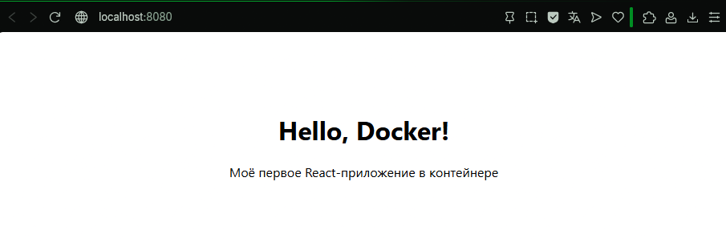

# React + Docker App

Простое React-приложение (счётчик кликов), упакованное в Docker-контейнер с использованием **многоступенчатой сборки**.

## Скриншот работающего приложения



## Требования

- Docker установлен на вашей системе
- (Опционально) Node.js для локальной разработки
        
## Сборка Docker-образа

```bash
docker build -t my-react-app .  